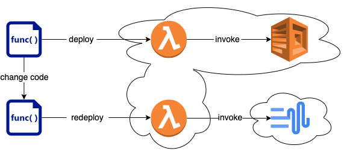
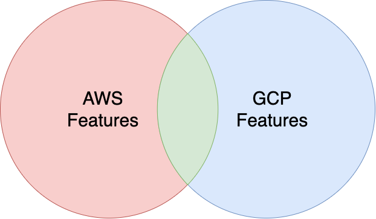
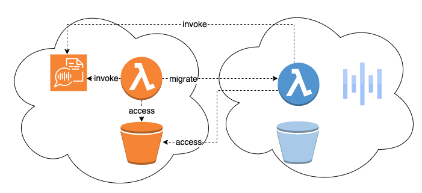
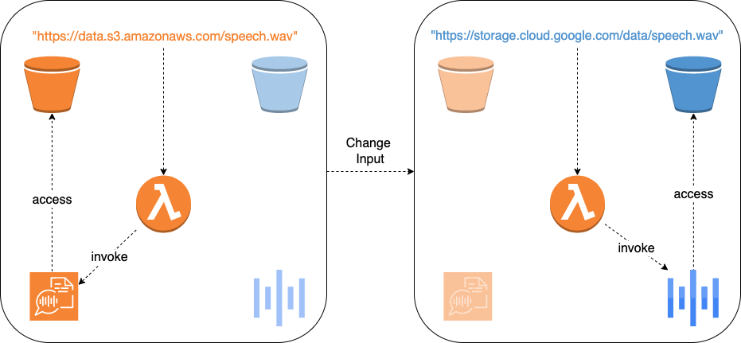
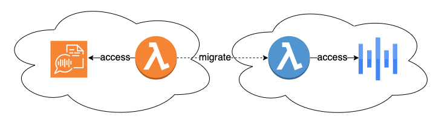
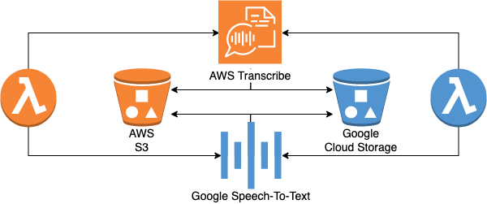
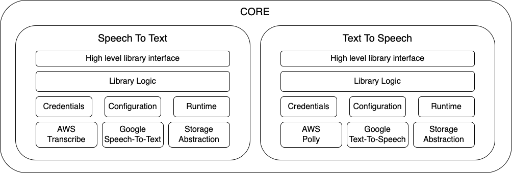
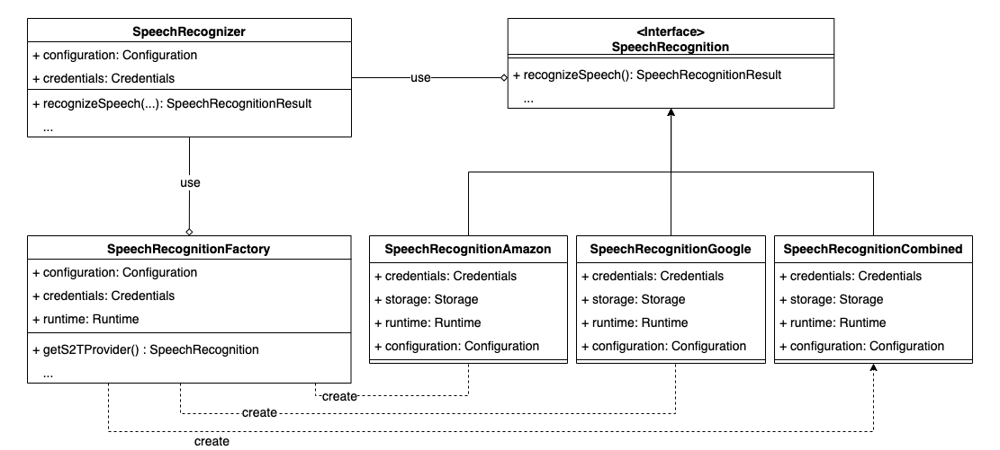

# CORE

CORE (core-once-run-everywhere) is an abstraction library for Speech-To-Text (S2T) and Text-To-Speech (T2S) services,
that hides the differences
between cloud
providers, by
offering a unified and simple interface for the most common use-cases. Developers can work with abstract service types
during development, while the concrete services are dynamically selected at runtime. Migration of a service from one
provider to another does not require code changes and only a single version of the code is needed for the deployment on
multiple providers, which significantly reduces development effort. Although there are existing abstraction libraries (e.g. LibCloud, jClouds)
that provide a unified interface for cloud services, they focus on infrastructure services (e.g. compute, network,
storage) and there is no
library for S2T and T2S services. As those two services are typically used together, CORE is a perfect fit for many use
cases like speech
translation, voice control and many more. Furthermore, functionality is added to automatically
infer and configure a provider (e.g. based on the location of the input file or supported features). This means that it
provides higher level of abstraction compared to other libraries, as
custom initialization logic is provided by the library itself.

# Table of Contents

1. [Motivation](#motivation)
2. [Architecture](#architecture)
3. [Implementation](#implementations)

## Motivation

The following section describes the benefits of using CORE compared to provider-specific SDKs and existing abstraction
libraries.

### Unified interface for all providers

Users may want to switch the provider of BaaS services (e.g. due to accuracy or costs) by replacing a service with
another
providers service of the same type, while preserving initial
functionality. Using provider-specific SDKs, migrating a service from one provider to another requires a high development effort. For
example, switching from AWS Polly to Google Text-To-Speech involves learning a
new
SDK, rewriting the code and redeploying the function to the new provider.



To bridge this gap, CORE offers a unified interface for both providers, which allows to switch the
provider by simply changing an input parameter. Migration of a service from one provider to another
does not require code changes and only a single version of the code is needed for the deployment on multiple providers,
which significantly reduces development effort.

```java
// run the service on AWS
speechSynthesizer.synthesizeSpeech(request,Provider.AWS);
// run the service on GCP
speechSynthesizer.synthesizeSpeech(request,Provider.GCP);
```

In addition, CORE offers a unified input and output format for all providers, so handling the data would not have to be
adjusted depending on what provider was used. For example,
Google Speech-To-Text specifies the word time offsets in ticks, where one tick is 100 ms, while AWS Transcribe reports
the offsets in seconds. The results returned by the concrete services are mapped to a common schema to hide those
differences from the user.

### Dynamic selection of BaaS services based on supported features

Users may want to use specific features that are only supported by a single provider. Some libraries (e.g. LibCloud)
decide to make all features available to the user. Therefore, provider-specific knowledge
is needed to avoid choosing a provider that does not support a certain
feature. In practice, this results in special cased code. Other libraries (e.g. pkgcloud) decide to offer only the
features
supported by all providers. However, the surface area that is consistent across all providers decreases with increasing
number of providers.



To bridge this gap, CORE dynamically selects the provider based on the desired features specified
by the user. For example, natural sounding speech should be generated from a text file. The desired audio format is `OGG_VORBIS`, which
is only supported by AWS Polly. In this case, the library will automatically infer the provider from the audio format.

```java
// audio format only supported by aws
speechSynthesizer.synthesizeSpeech(request,SynthesisAudioFormat.OGG_VORBIS);
```

If the audio format is changed to `OGG_OPUS`, the library will automatically switch to Google Text-To-Speech, as this
format is only supported by GCP.

```java
// audio format only supported by gcp
speechSynthesizer.synthesizeSpeech(request,SynthesisAudioFormat.OGG_OPUS);
```

Users may select a combination of features that cannot be handled by a single provider.
For example, generating subtitles as part of the speech recognition process is only supported by AWS Transcribe, while
profanity filter is only
supported by Google Speech-To-Text. In this case, the service is invoked on both providers and the results are
merged together. Merging of results is only possible for S2T and not for T2S, since it is not possible to merge
audio files.

```java
SpeechRecognitionFeatures features=SpeechRecognitionFeatures.builder()
    .srtSubtitles(true) // only supported on AWS
    .profanityFilter(true) // only supported on GCP
    .build();
speechRecognizer.recognizeSpeech(request,features);
```

### Dynamic selection of BaaS services based on location of the data

Users may want to migrate a function that uses BaaS services from one provider to another. If we naively migrate the
function, it still accesses the services of
the old provider. Traffic is flowing from one cloud to another leading resulting in
higher costs due to the providers pricing models. Furthermore, network proximity and transport costs may be increased, which
impacts the performance.



To bridge this gap, CORE allows to dynamically select the provider and region where to run the service, based on the location of
the data. For S2T, the input is audio and the output is text. Under the assumption that audio is larger than text, the
service
should be moved close to the input. AWS
Transcribe and Google Speech-To-Text process the input directly from cloud storage. The library automatically detects where the
storage bucket is located and invokes the service on the same provider and region. 



For T2S, the input is text and the output is audio. Hence, the service
should be moved close to the output. AWS Polly and Google Text-To-Speech do not support to write the result directly to
cloud storage. Instead, the synthesized speech is returned to the function. Hence, the service
should run close to the function. The library automatically detects where the function is running and invokes the
service on the same provider and region. If the function is migrated to another provider the library will
automatically select the new provider without the need for any code changes.



### Abstraction for chained BaaS services

Users may want to migrate a service that itself uses another service from one provider to another. For example, Google Speech-To-Text should be migrated to AWS Transcribe and the input data is stored in Google Cloud Storage. Data movements may be required before invoking the service, since AWS Transcribe can not
consume data directly from Google Cloud Storage. Therefore, the migration of chained BaaS services may involve code changes even
though the services itself are portable, which results in a high development effort. For example, 8 deployment packages are needed, if a function that transcribes
speech from an audio file that is stored in some cloud storage should be deployed on two providers.



To bridge this gap, the files are automatically moved
internally if
necessary. For example, an audio file that is stored in Google Cloud Storage should be transcribed and
the service should run on AWS (e.g. due to accuracy or cost). AWS Transcribe
process the input directly from an AWS S3 bucket, hence the library automatically moves the input file to a temporary S3
bucket before invoking the service.

```java
SpeechRecognitionRequest request=SpeechRecognitionRequest.builder()
    .inputFile("https://storage.cloud.google.com/bucketname/output.mp3")
    // other parameters
    .build();
speechRecognizer.recognizeSpeech(request,Provider.AWS);
```

Another example would be that a text file that is stored in AWS S3 should be synthesized using ogg opus audio format.
The desired audio format is only supported by GCP, but Google Text-To-Speech can not consume data from AWS S3. In this
case,
the library automatically downloads the input file before invoking the service.

```java

SpeechSynthesisRequest request=SpeechSynthesisRequest.builder()
    .inputFile("https://bucketname.s3.us-east-1.amazonaws.com/input.txt")
    // other parameters
    .build();
speechSynthesizer.synthesizeSpeech(request,SynthesisAudioFormat.OGG_OPUS);
```

## Architecture

The library consists of two modules. One module for S2T and another module for T2S. Both modules
follow a layered architecture. On top, the high level interface that is exposed
to the user. Next, the logic which is required for abstracting the concrete cloud services. Below are the
credentials, configuration and runtime, which are reused in both modules. The credentials contain the functionality
for loading the credentials and provide methods for returning the credentials of a specific provider. The configuration
can be used to configure default values (e.g. provider and region). Runtime provides methods for detecting the
provider and region of the serverless function executing the code, or whether the code is running in a serverless
environment at all. On
the bottom, the provider-specific
SDKs are used to connect to the concrete cloud services. Additionally, a storage abstraction is reused in both modules,
which
provides a unified interface for cloud storage services. The concrete services are Google Speech-To-Text, AWS
Transcribe, Google
Text-To-Speech, AWS Polly, Google Cloud Storage and AWS S3.



The `SpeechRecognition` interface defines the unified interface for all providers. The concrete provider specific
implementations are
contained in the `SpeechRecognitionAmazon` and `SpeechRecognitionGoogle` classes, that implement the `SpeechRecognition`
interface.
The `SpeechRecognitionCombined` runs the service on both providers and merges the result.
The `SpeechRecognitionFactory` is responsible for the creation of
providers and decides, which provider and region to use. It provides methods to select the provider based on features,
input location etc.
Finally, the `SpeechRecognizer` is intended to be used by the client code.
It is using the factory to automatically infer and configure a provider. The T2S service follows a similar
structure.



With this class structure in place, adding support for another provider can be done in the following steps. First, a new
class implementing the SpeechRecognition interface has to be added, which must contain all the necessary code
to make the remote calls to the newly supported provider. The credentials for the new provider must be added and the
methods for loading the credentials must be adapted. Finally, the SpeechRecognitionFactory has to be extended to create and
configure the new provider.

## Implementation

### Speech-To-Text Interface

The `recognizeSpeech` method is overloaded three times. The first version allows to select the provider explicitly. The
second version allows to select the provider implicitly based on the features. The third version allows to select the
provider based on the location of the input file.

```java
SpeechRecognitionResponse recognizeSpeech(SpeechRecognitionRequest request,Provider provider);
SpeechRecognitionResponse recognizeSpeech(SpeechRecognitionRequest request,SpeechRecognitionFeatures features);
SpeechRecognitionResponse recognizeSpeech(SpeechRecognitionRequest request); 
```

```java
class SpeechRecognitionRequest {
    String inputFile; // local filesystem, AWS S3, Google Cloud Storage
    int sampleRate; // audio frequency in Hz
    int channelCount; // 1 for mono and 2 for stereo
    String languageCode; // W3C language code (e.g. en-US, de-DE, etc)
}
```

```java
class SpeechRecognitionResponse {
    String fullTranscript; // transcript of the whole audio file
    List<Word> words; // information about each detected word
    String srtSubtitles; // subtitles in SRT format
    String vttSubtitles; // subtitles in VTT format
}
```

```java
class SpeechRecognitionFeatures {
    boolean srtSubtitles; // generate subtitles in srt format
    boolean vttSubtitles; // generate subtitles in vtt format
    boolean profanityFilter; // mask profane words with asterisk
    boolean spokenPunctuation; // detect spoken punctuation (e.g. question mark)
    boolean spokenEmoji; // detect spoken emojis (e.g. raised hand)
}
```

```java
class Word {
    Double startTime; // duration from start of audio file to the beginning of the word in seconds
    Double endTime; // duration from start of audio file to the end of the word in seconds
    Double confidence; // confidence score between 0 and 1
    String content; // the word itself
}
```

### Text-To-Speech Interface

The `synthesizeSpeech` method is overloaded three times. The first version allows to select the provider explicitly. The
second version allows to select the
provider implicitly based on the desired audio format. The third version allows to select the provider based on the
location of the function.

```java
SpeechSynthesisResponse synthesizeSpeech(SpeechSynthesisRequest request,Provider provider);
SpeechSynthesisResponse synthesizeSpeech(SpeechSynthesisRequest request,AudioFormat audioFormat);
SpeechSynthesisResponse synthesizeSpeech(SpeechSynthesisRequest request);
```

```java
class SpeechSynthesisRequest {
    String inputFile; // local filesystem, AWS S3, Google Cloud Storage
    String language; // for example en-US or de-DE
    TextType textType; // PLAIN_TEXT | SSML
    Gender gender; // MALE | FEMALE
}
```

```java
class SpeechSynthesisResponse {
    byte[] audio; // binary audio stream containing the synthesized speech
}
```

### Storage Abstraction

A storage
abstraction was developed, which offers a uniform interface to
interact with all supported storage backends in the same way. As both libraries need to access files stored on multiple storage backends, this part was decomposed into a separate
module, which can be reused by both libraries.

```java
byte[] read(String fileUrl);
void write(byte[]data,String fileUrl);
boolean delete(String fileUrl);
String createBucket(String bucketUrl);
String deleteBucket(String bucketUrl);
```

Files can
be uploaded, downloaded and deleted using the `read()`, `write()` and `delete()` methods. Additionally, storage buckets
can
be created and delete using the `createBucket()`and `deleteBucket()` methods. Files are specified by URLs, which are
automatically parsed to infer provider, region, bucket and file
name. 

```java
class FileInfo {
    boolean isLocal; // true if the file is stored on the local filesystem
    String fileName; // the name of the file
    String fileUrl; // the complete url
    BucketInfo bucketInfo; // information parsed from the bucket url

    static FileInfo parse(String fileUrl); // parse file url
}
```

```java
class BucketInfo {
    ProviderType provider; // the provider where the bucket is located
    String location; // the geographical location of the storage bucket
    String bucketName; // the bucket name
    String bucketUrl; // complete the bucket url with trailing slash

    static BucketInfo parse(String fileUrl); // parse bucket url
}
```

Internally, files and buckets are represented as objects, which contain the information that was parsed from the URL.
Additionally, there are static methods to parse URLs and convert them to objects.

### Credentials

The `Credentials` class offers static methods to load the credentials. `loadFromFile()` can be used to load the
credentials from anywhere on the filesystem. It can handle absolute paths or relative paths starting from the current
working directory. `loadFromResourceFolder()` takes a relative path starting from the
resource-folder. `loadDefaultCredentials()` searches for a credentials.json file in the resource-folder. All three
methods return a credentials object that is a wrapper around the credentials of all providers and offers getters for
obtaining the credentials of a specific provider.

```java
Credentials loadFromFile(String path);
Credentials loadFromResourceFolder(String path);
Credentials loadDefaultCredentials();
```

### Configuration

Default provider and regions can be overwritten in the configuration object, that is passed to the constructor of the
service during initialization.

```java
class Configuration {
    Provider defaultProvider;
    String defaultAwsRegion;
    String defaultGcpRegion;
}
```

### Runtime

The runtime object provides methods to detect in which runtime environment the code is running. `getFunctionProvider()`
returns the provider where the function is running or null, if the code is not running inside a serverless
function. `getFunctionRegion()` returns the geographical region where the function is located or null, if the code is
not running inside a serverless function.

```java
Provider getFunctionProvider();
String getFunctionRegion();
```

### Implementation Challenges

Invoking S2T services on AWS and GCP requires specifying a voice to use for synthesis. Each voice supports a specific
language and gender. In order
to relieve the user of the decision as to which voice should be used, all voices were queried in advance and saved in
json files. The library automatically selects a voice that supports the desired language and gender by searching
those json files. As a result, the user does not
need to have provider specific knowledge about the voices and no additional request has to be made to query the voices
on each invocation of the service.
