# Evaluation

## Functions

### Function Types

There are two function types. Both functions read and write input and output from and to cloud storage. 

**speech-recognition:** S2T on an audio file. 

**speech-synthesis:** T2S on a text file. 

### Function Implementations

Using provider-specific SDKs, eight versions of the code are required per function type, since input, output and service can be placed either on AWS or GCP. 
* 2 x input
* 2 x output
* 2 x service

Using CORE, only a single version of the code is required per function type. 

### Function Deployments

Each function implementation can be deployed either on AWS or GCP, resulting in two function deployments per function implementation. 

## Evaluation

### Code Size

Using CORE reduces the development effort compared to native provider specific SDKs. First, native SDKs support a lot of customization options that only very few people might need, which leads to a more complicated client code. Second, in a multi- provider use case, multiple deployment packages have to be developed with provider-specific SDK’s, while only a single one is required using CORE. To investigate this, the development effort when using CORE is compared to provider-specific SDKs, by measuring the LOC of all function implementations. 

The measurement was carried out as follows. First, code snippets were implemented. For example, one snippet may upload a file to cloud storage and another snippet may invoke speech recognition or synthesis. Next, The LOC of the snippets were counted. Finally, the snippets were added up to obtain the required LOC for each function implementation. Serverless function handlers and comments were ignored. 

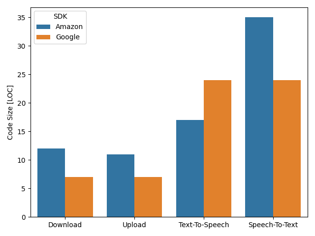

Using the amazon SDK needs 17.33% more LOC on average compared to the google SDK. This does however depend on the use case, as for text-to-speech google requires 7 LOC more compared to amazon. This shows that using the amazon SDK does not always entail a higher number of lines of code necessary, compared to the other native provider.

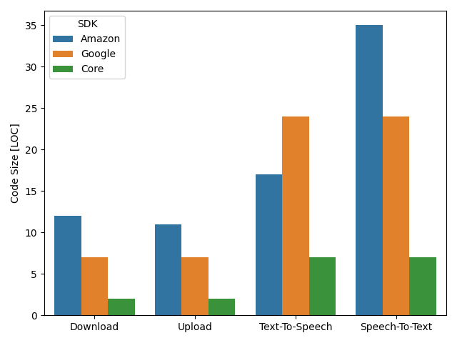

Regarding CORE, it can be seen that, on average, it needs 70.96% less LOC compared to google and 76.00% less compared to amazon. 

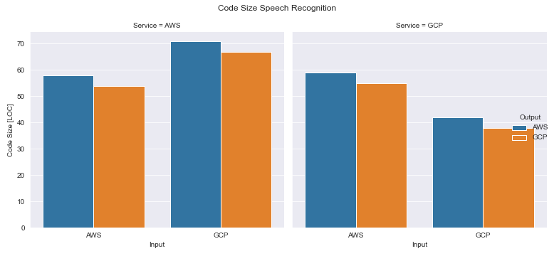

The largest implementation (71 LOC) is the one where the input is on google, while output and service are on amazon. The smallest implementation (38 LOC) is the one where google is used for everything. 

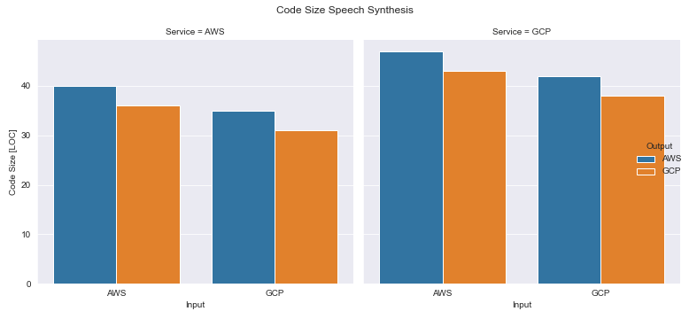

A very similar picture emerges when comparing the code sizes of speech synthesis function implementations.

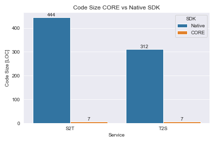

Regarding CORE, we can see that the code size is reduced by 98.42% for speech recognition and 97.75% for speech synthesis. 

### Package Size

The way Core uses provider specific SDKs to forward requests has an effect on the size of the library. A new SDK has to be included in the library for every new supported provider, meaning that the package size scales linearly with the number of supported providers.

The measurement was carried out as follows. First, the size of each individual dependency was measured. Next, the package size of all function implementations was measured by including the required dependencies, running a maven build and creating a fat jar. FaaS dependencies (AWS Lambda and GCP Cloud Functions) were neglected, as they are only a few KB. 

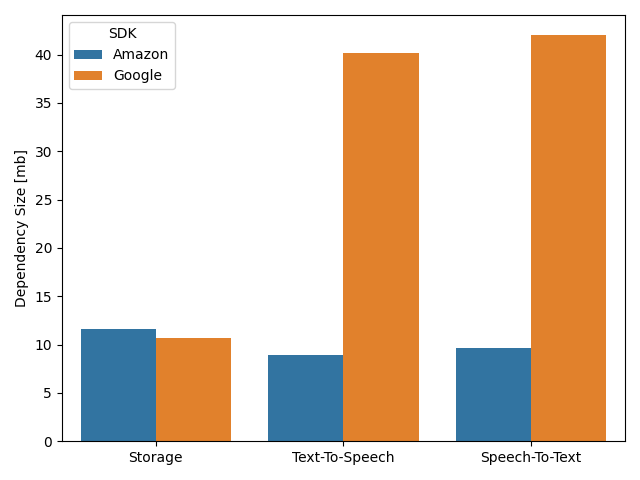

Google provides a smaller storage library while amazon provides smaller text-to-speech and speech-to-text libraries. On average, the google SDKs are 67.59% larger compared to the amazon SDKs. 

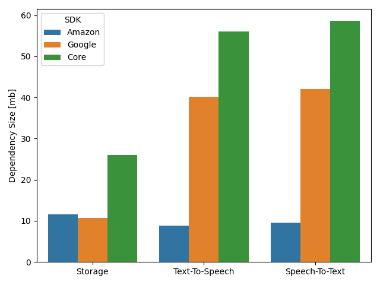

Regarding CORE, it can be seen that, on average, it has 33.97% larger dependency size compared to google and 78.60% larger compared to amazon.

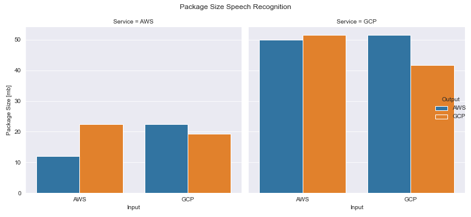

The largest deployment package (51.6mb) are those where input and output are on different providers and the service is on google. The smallest deployment package (12.1mb) is the one where amazon is used for everything. The size added to a package isn’t equivalent to the sum of sizes of the used libraries, as some transitive dependencies of the libraries might be shared, in which case they are only included once. For example, amazon storage and text-to-speech together are 12.1mb, although the sum of the individual dependencies is 21.1mb (11.6 + 9.6).

A very similar picture emerges when comparing the package sizes of speech synthesis function implementations.

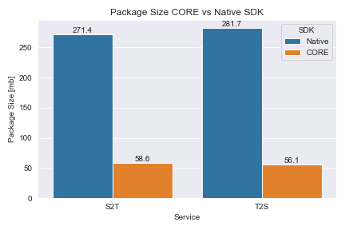

Regarding CORE, we can see that the package size for speech recognition is reduced by 78,40% and for speech synthesis it is reduced by 80.08%.

### Deployment Time Sequential

It is important to investigate whether the larger package sizes have an impact on the deployment time. Therefore, the SDKs are compared according to (1) the time it takes to upload the deployment package to the cloud provider (2) the time it takes to create the actual serverless function. The total deployment time is the sum of upload time and create function time. 

The measurements were obtained by deploying and deleting a single function 10 times from the local machine located in innsbruk and taking the average. The functions were deployed in us-east-1 in amazon and us-east1 in google. 

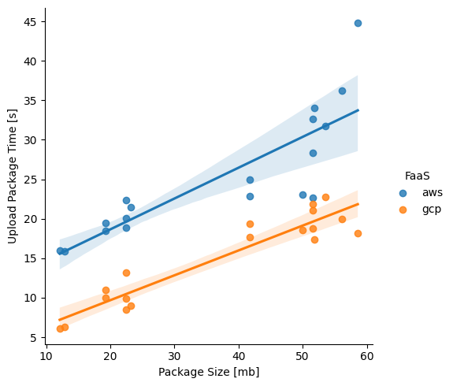

We can observe that the uplaod time increases linearly for larger package sizes. This is expected, as it highly depends on the network bandwidth. The average upload time 42.97% faster on google compared to amazon. 

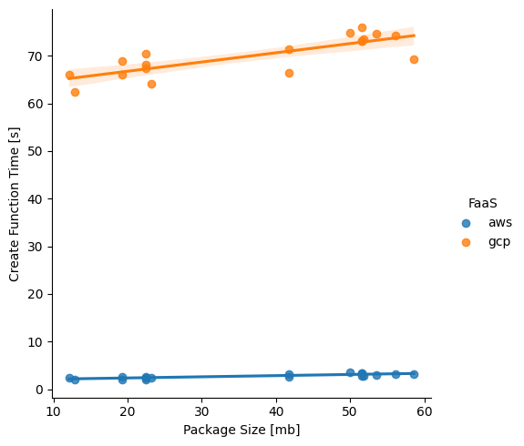

The create function time is constant on both providers and does not increase significantly for larger package sizes. The average create function time is 96.15% faster on amazon compared to google. 

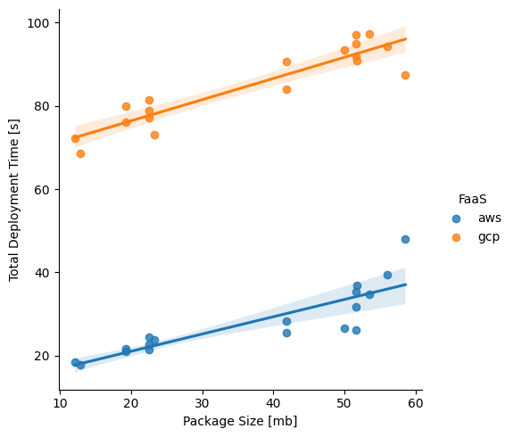

The average total deployment time is 67.95% faster on amazon compared to google.

### Deployment Time Parallel

For a meaningful analysis regarding deployment time in a multi-provider use case it is necessary, to measure the parallel deployment of 8 native SDK versions and compare it to the deployment time of a single Core version. 

The functions were deployed in parallel 5 times from the local machine located in innsbruk and the average was taken. The other settings (e.g. region) were the same as for the sequential deployment. 

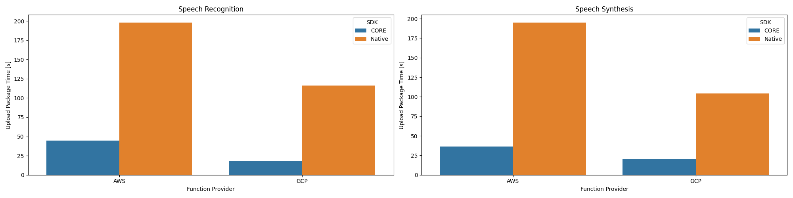

We can observe that the deployment packages are uploaded 41.37% faster to google compared to amazon for speech recognition and 46.61% faster for speech synthesis. Regarding Core, the deployment packages are uploaded 82.66% faster to google and 79.43% faster to amazon on average compared to the versions implemented using native SDKs. 

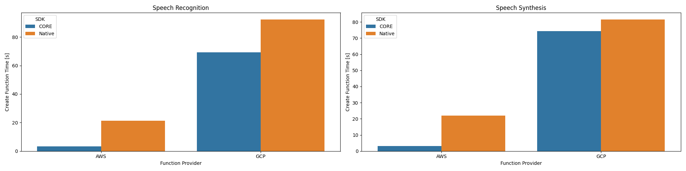

The functions are created 77.10% faster on amazon compared to google for speech recognition and 73.03% faster for speech synthesis. Regarding Core, on average the function are created 18.10% faster on google and 85.18% faster on amazon compared to the functions implemented using native SDKs. 

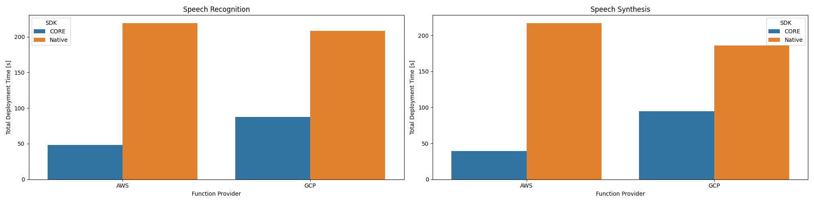

The total deployment time is 4.92% faster on google compared to amazon for speech recognition and 14.45% faster for speech synthesis. Regarding Core, on average the total deployment time is 53.93% faster on google and 79.98% faster on amazon compared to the functions implemented using native SDKs. 

### Runtime Overhead 

Since the library adds an additional layer on top of the provider specific SDKs, it is important to investigate whether executing the library logic results in a performance overhead. 

The functions were executed 10 times from the local machine and the round trip time was measured and averaged. Intput, output functions and services were all placed in the same region, us-east-1 on amazon and us-east1 on google. 

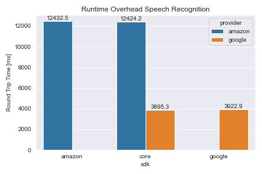

When comparing the round trip time of functions implemented using CORE and those implemented using the provider-specific SDKs, it can be observed that there is no significant difference. The CORE versions are even a bit faster, with 0.06% on amazon and google. However, this may be caused by variations in the measurements. 

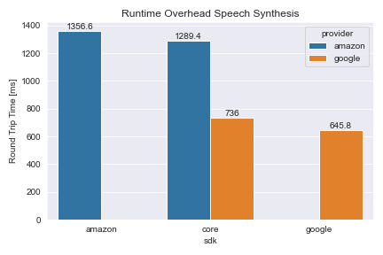

The CORE versions are 4.94% faster on amazon and 12.36% slower on google. Similar as before, the difference is so small that it is negligible. 
